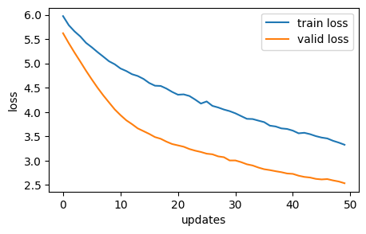
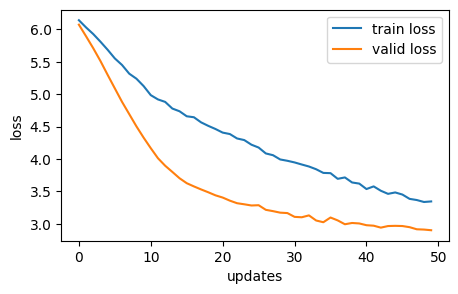
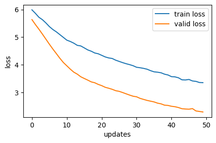

This is a machine translation engine project that translates thai to english according to the provided texts.
There are 3 attention mechanisms including Additive attention, General Attention, and Multiplicative Attention.
The performance graphs from the three algorithms are illustrated below:

General Attetion

Additive Attention

Multiplicative Attention

